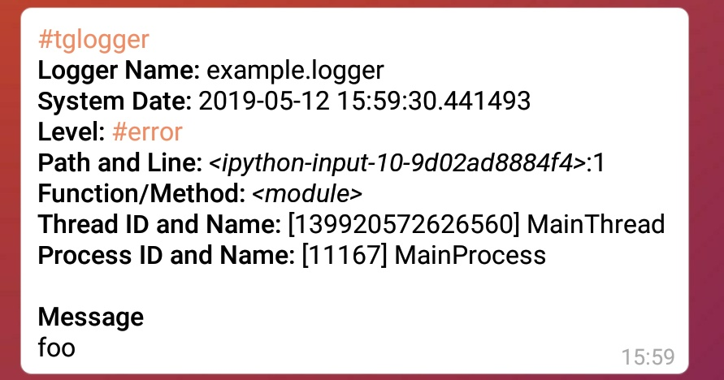

# Getting Started

## Installing

You can install `tglogger` with `pip`:

    pip install tglogger

## Setting Up Environment

In order to use `tglogger`, you need to have;

 - a bot
   - grab the bot's token
   - get chat id

### 1. Setting Up Bot

You can create your own bot, you need to start a chat with
[BothFather][botfather_url]. Then BotFather will help you to create a bot.

[botfather_url]: https://t.me/BotFather

After you have created your bot, remember to grab the token of your bot.

### 2. Getting Chat ID

If you will send the logs to yourself, simply use
[userinfobot][userinfobot_url]. When you message to *userinfobot*, you will
get your user id, which is the same as chat id.

[userinfobot_url]: https://t.me/BotFather

Getting a chat id for a group is a bit harder. First, you need to add your bot
to the target group, then send a message with *any content* (it is convenient
to send a message with content `/start` to bots).

Then you need to get messages from your bots. Simply send a `POST` request to
the corresponding URL.

```
https://api.telegram.org/bot<YourBotToken>/getUpdates
```

!!! info
    Replace `YourBotToken` with your bot's token. For more information about
    `getUpdates`, see [the related section of the documentation][getUpdates_url].

This endpoint will respond with an array of [update object][update_object_url]s.

You can get chat id from `update.message.chat.id` path of any JSON object.

!!! warning
    Add the correct chat id. Observe the responded JSON array carefully.

[getUpdates_url]: https://core.telegram.org/bots/api#getupdates
[update_object_url]: https://core.telegram.org/bots/api#update

## Usage

!!! warning
    It is assumed that you have already initialized a `Logger` instance called
    `logger`.

Below is a generic initialization of `TelegramHandler` and `TelegramFormatter`:

```python
# importing
from tglogger.handler import TelegramHandler
from tglogger.formatter import TelegramFormatter

telegram_handler = TelegramHandler(bot_token="foo", receiver="1")  # initialize handler
telegram_formatter = TelegramFormatter()  # initialize formatter

telegram_handler.setFormatter(telegram_formatter)  # inject formatter into handler
logger.addHandler(telegram_handler)  # inject handler into logger
```

After these steps, any log above `ERROR` will be sent to target chat[^1].

```python
logger.error("foo")
```



[^1]:
    You can change level offset by passing `level` to `TelegramHandler`
    while you initialize it.
